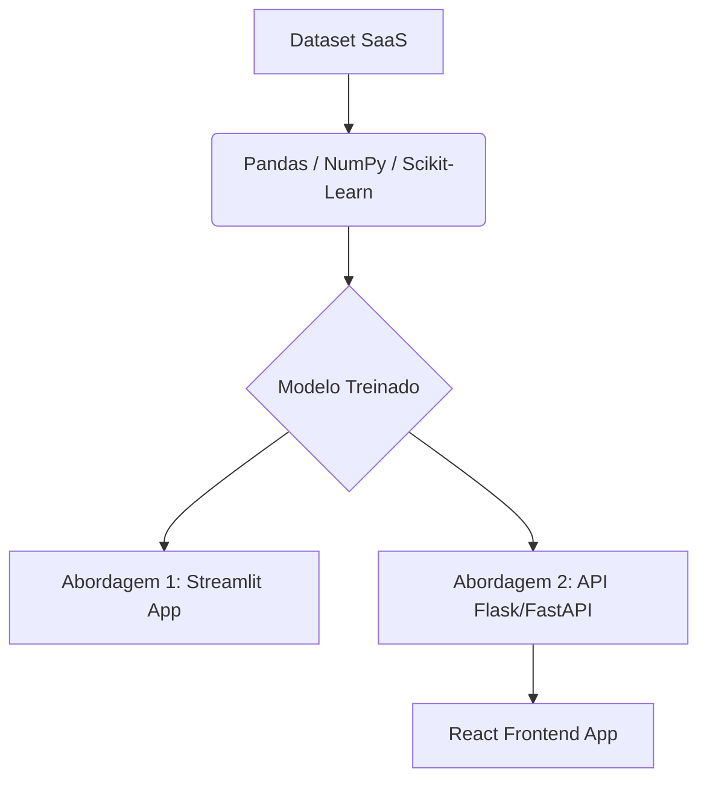
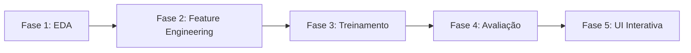

# ChurnGuard: Guia de Arquitetura e Implementação para Previsão de Churn em SaaS

Este documento serve como o guia conceitual, arquitetural e técnico para a implementação do projeto **ChurnGuard** — um sistema inteligente de previsão de cancelamento de clientes (churn) em empresas SaaS (Software as a Service).

---

## 1. Visão Geral do Projeto

### O Problema de Negócio
No ecossistema SaaS, a retenção de clientes é a métrica de crescimento mais crítica. Adquirir um novo cliente (CAC) custa significativamente mais do que reter um atual. O **Churn** (cancelamento da assinatura) impacta diretamente a receita recorrente mensal (MRR) e o valor do tempo de vida do cliente (LTV). 

Identificar de forma proativa quais clientes estão sob risco de cancelamento permite que as equipes de Sucesso do Cliente (Customer Success) ajam preventivamente com campanhas de engajamento, descontos ou suporte direcionado.

### O que este Projeto Demonstra no Portfólio
Este projeto atua na intersecção perfeita entre **Ciência de Dados (Analytics/Machine Learning)** e **Engenharia de Front-End**, provando a capacidade de:
*   Traduzir um problema de negócio real em uma solução matemática e de software.
*   Manipular, limpar e analisar dados estruturados complexos.
*   Desenvolver, validar, balancear e avaliar modelos preditivos de classificação clássicos e modernos.
*   Criar interfaces web interativas elegantes para que tomadores de decisão ou equipes de negócios consumam modelos de inteligência artificial em tempo real.

---

## 2. Pilha Tecnológica (Tech Stack)

Para garantir uma solução ágil e de alta performance, propomos duas abordagens arquiteturais para a interface de visualização.



### Núcleo de Dados e Machine Learning (Python)
*   **Python (3.9+)**: Linguagem base do projeto.
*   **Pandas & NumPy**: Manipulação, limpeza de dados e vetorização estatística.
*   **Scikit-Learn**: Pré-processamento, divisão de dados, treinamento de modelos clássicos e métricas de avaliação.
*   **XGBoost / LightGBM** (Opcional): Para testar algoritmos avançados de gradiente boosting de árvore se desejada maior acurácia.
*   **Joblib**: Serialização e exportação do modelo preditivo e dos transformadores de escala.
*   **Seaborn & Matplotlib**: Geração de gráficos estáticos e relatórios na fase de análise exploratória (EDA).

### Interface de Visualização (Duas Alternativas)

#### Alternativa A: Streamlit (Recomendada para Velocidade de Entrega)
*   **Vantagens**: Permite escrever toda a interface em Python, integrando facilmente sliders, inputs e componentes gráficos de dados em poucas linhas de código.
*   **Estilo**: Customizável via configurações de tema do Streamlit (com suporte nativo a dark mode).

#### Alternativa B: Arquitetura Desacoplada (React + FastAPI / Flask)
*   **Back-End (FastAPI)**: Cria um endpoint `/predict` rápido que recebe os dados do cliente em formato JSON, roda o modelo carregado pelo `joblib` e retorna a probabilidade de churn.
*   **Front-End (React + Tailwind CSS)**: Interface moderna com Glassmorphism, efeitos neon, e gráficos dinâmicos usando Chart.js ou ApexCharts para renderizar o score de risco do cliente de forma premium.

---

## 3. Estrutura do Dataset (Features)

Para simular um ambiente SaaS real de assinatura B2B/B2C, o dataset conterá as seguintes variáveis (features):

| Nome da Feature | Tipo de Dado | Descrição | Exemplo de Valores |
| :--- | :--- | :--- | :--- |
| `tempo_assinatura_meses` | Inteiro | Quantidade de meses que o cliente está ativo na plataforma. | `1` a `72` |
| `frequencia_login_mensal` | Inteiro | Número de vezes que o usuário fez login nos últimos 30 dias. | `0` a `30` |
| `tickets_suporte_abertos` | Inteiro | Quantidade de reclamações ou chamados abertos no suporte técnico. | `0` a `10` |
| `valor_mensal_pago` | Float | Valor da assinatura mensal em R$ ou USD. | `29.90` a `499.00` |
| `reclamacoes_registradas`| Binário | Se o cliente registrou alguma reclamação formal recentemente (0: Não, 1: Sim). | `0` ou `1` |
| `uso_dados_gb` | Float | Quantidade de dados/recursos consumidos na plataforma (ex: armazenamento). | `0.5` a `500.0` |
| **`churn` (Target)** | Binário | Status de cancelamento (0: Cliente Ativo, 1: Cancelou). | `0` ou `1` |

> [!TIP]
> Em produção, se não houver um dataset público imediato disponível (como o famoso *Telco Churn Dataset* do Kaggle), pode-se gerar um dataset sintético estatisticamente coerente usando a biblioteca `numpy.random` para simular as correlações (ex: mais tickets de suporte e maior preço mensal devem aumentar a probabilidade de churn).

---

## 4. Fases do Ciclo de Ciência de Dados



### Fase 1: Análise Exploratória de Dados (EDA)
Realizada em um Jupyter Notebook (`churn_exploration.ipynb`).
*   **Distribuição da Variável Target**: Verificar se há desbalanceamento de classes (geralmente há muito mais ativos `0` do que churns `1`).
*   **Matriz de Correlação**: Identificar quais variáveis têm correlação positiva com o Churn (ex: `reclamacoes_registradas` e `tickets_suporte_abertos`) e quais têm correlação negativa (ex: `tempo_assinatura_meses` e `frequencia_login_mensal`).
*   **Visualizações Críticas**:
    *   Gráfico de densidade (KDE Plot) de `tempo_assinatura_meses` dividido por Churn.
    *   Boxplot comparativo de `valor_mensal_pago` agrupado por Churn.

### Fase 2: Feature Engineering & Pré-processamento
*   **Tratamento de Dados Categóricos**: Aplicar One-Hot Encoding se houver variáveis como `tipo_plano` (Básico, Padrão, Premium).
*   **Dimensionamento de Recursos**: Aplicar `StandardScaler` ou `MinMaxScaler` do Scikit-Learn nas variáveis numéricas de escalas muito diferentes (como `valor_mensal_pago` e `tickets_suporte_abertos`).
*   **Balanceamento de Classes**: Se o dataset for muito desbalanceado (ex: 90% ativo, 10% churn), aplicar a técnica **SMOTE (Synthetic Minority Over-sampling Technique)** usando a biblioteca `imblearn` para balancear a classe minoritária no conjunto de treino.

### Fase 3: Treinamento e Seleção de Modelos
Treinar múltiplos classificadores e comparar a performance:
1.  **Regressão Logística**: Modelo de baseline rápido e altamente interpretável.
2.  **Random Forest Classifier**: Robusto, lida bem com relações não-lineares e fornece a importância das features (*Feature Importance*).
3.  **XGBoost Classifier**: Algoritmo estado-da-arte baseado em árvores de decisão impulsionadas por gradiente.

Exportar o melhor modelo treinado e o scaler correspondente:
```python
import joblib
joblib.dump(best_model, 'churn_model.pkl')
joblib.dump(scaler, 'scaler.pkl')
```

### Fase 4: Avaliação do Modelo
A avaliação não deve se basear apenas na Acurácia (que é enganosa em classes desbalanceadas). Devemos reportar:
*   **Precisão**: De todos os previstos como Churn, quantos realmente eram? (Evita falsos alertas).
*   **Recall (Sensibilidade)**: De todos os clientes que cancelariam, quantos o modelo conseguiu detectar? (Mais crítico para o negócio SaaS).
*   **F1-Score**: Média harmônica entre precisão e recall.
*   **Matriz de Confusão**: Visualização de acertos e erros.
*   **Área Sob a Curva ROC (ROC-AUC)**: Capacidade do modelo de distinguir entre as duas classes.

### Fase 5: Criação da UI Interativa (ChurnGuard Simulator)
Uma interface rica e focada na experiência do usuário para permitir a simulação do perfil de um cliente.

#### Design & Identidade Visual
*   **Tema**: Dark Mode de alta tecnologia.
*   **Paleta de Cores**:
    *   *Fundo*: Deep Navy (`#0B0F19`) / Dark Slate.
    *   *Acentos Neutros/Bons*: Cyber Blue (`#00F2FE` ou `#4FACFE`) para denotar estabilidade e saúde operacional.
    *   *Acentos de Risco*: **Cyber Crimson** (`#FF3366` ou `#FF0055`) para chamar atenção imediata a taxas de risco elevadas.
*   **Efeitos**: Glassmorphism (painéis com fundo translúcido e bordas sutis brilhantes).

#### Comportamento da UI
*   O usuário ajusta os sliders (ex: colocar `tempo_assinatura_meses = 2` e `tickets_suporte_abertos = 8`).
*   Ao mudar os valores, a aplicação processa o modelo instantaneamente em segundo plano.
*   **Condicional de Alerta**:
    *   Se a probabilidade calculada for **< 50%**: Exibe o status do cliente em verde/azul neon ("Cliente Saudável - Baixo Risco").
    *   Se a probabilidade calculada for **>= 50%**: A interface aciona um alerta visual destacado em **Cyber Crimson**, indicando "ALERTA: Alto Risco de Churn" com recomendações automáticas (ex: "Oferecer desconto na renovação" ou "Agendar call de Customer Success").

---

## 5. Roteiro de Desenvolvimento (5 Etapas)

### Passo 1: Preparação do Ambiente e Geração dos Dados
1. Crie a pasta do projeto `churn_guard` na estrutura do portfólio.
2. Configure um arquivo `requirements.txt` com: `pandas`, `numpy`, `scikit-learn`, `matplotlib`, `seaborn`, `joblib`, `streamlit` e `imbalanced-learn`.
3. Escreva um script `generate_data.py` para criar um arquivo `saas_churn_data.csv` simulando 5.000 clientes e seus respectivos históricos com base em regras de correlação realistas.

### Passo 2: Construção do Notebook Analítico (EDA & ML)
1. Crie o notebook `churn_model.ipynb`.
2. Realize a análise exploratória documentada com gráficos de correlação e distribuição.
3. Desenvolva o pipeline de pré-processamento (limpeza, escalonamento e balanceamento).
4. Treine os classificadores, execute a validação cruzada (`GridSearchCV` para tunagem de hiperparâmetros) e compare as métricas de performance.
5. Salve o melhor classificador e o scaler em arquivos `.pkl`.

### Passo 3: Criação da API de Predição (Opcional - se usar React)
1. Escreva um arquivo `app_api.py` usando FastAPI.
2. Crie uma rota POST `/predict` que decodifique o payload JSON dos dados do cliente, execute o scaler, rode o classificador e retorne a probabilidade (float de 0 a 1).

### Passo 4: Desenvolvimento do Front-End / Web App
*   **Cenário Streamlit**:
    1. Crie o arquivo `app.py`.
    2. Adicione os inputs na barra lateral (sidebar) ou em colunas na tela principal usando sliders para variáveis numéricas (`st.slider`) e caixas de seleção para categóricas.
    3. Escreva a lógica para carregar o modelo em cache (`st.cache_resource`) para evitar lentidão.
    4. Implemente as condições visuais de exibição e os alertas **Cyber Crimson** caso a predição ultrapasse 0.5.
*   **Cenário React (Premium)**:
    1. Integre no portfólio web uma nova página estilizada em Tailwind CSS com formulários dinâmicos.
    2. Use `fetch` ou `axios` para se comunicar com a API do FastAPI.
    3. Utilize a biblioteca ApexCharts ou Chart.js para criar um gauge gráfico (velocímetro) que mude de cor dinamicamente (de azul/verde neon para vermelho Cyber Crimson) conforme a probabilidade muda.

### Passo 5: Testes, Refinamento e Deploy
1. Valide a precisão do simulador ajustando inputs extremos (valores ótimos vs. valores péssimos de engajamento).
2. Escreva o arquivo `README.md` do repositório descrevendo como rodar a aplicação localmente e explicando o impacto de negócio.
3. Faça o deploy (ex: Streamlit Sharing, Render, ou Vercel se for React + backend integrado).

---

## 🌟 Mensagem de Incentivo

> "A beleza da análise de dados não está apenas em encontrar padrões abstratos em uma planilha, mas em traduzir esses padrões em ações estratégicas de negócios que salvam receitas. O **ChurnGuard** é a representação perfeita dessa jornada: desde o dado bruto, passando pelo rigor científico dos modelos preditivos, até uma interface visual deslumbrante que qualquer executivo de negócios adoraria usar. Ao implementar este projeto com o cuidado de design que planejamos (especialmente os alertas em Cyber Crimson e o visual premium em dark mode), você irá se destacar não apenas como um técnico excelente, mas como um desenvolvedor com sensibilidade de produto e de mercado. Mãos à obra!"

---
*Desenvolvido pelo time de Idealização de Design & Conceitos - Subagente Cabeça Pensante.*
